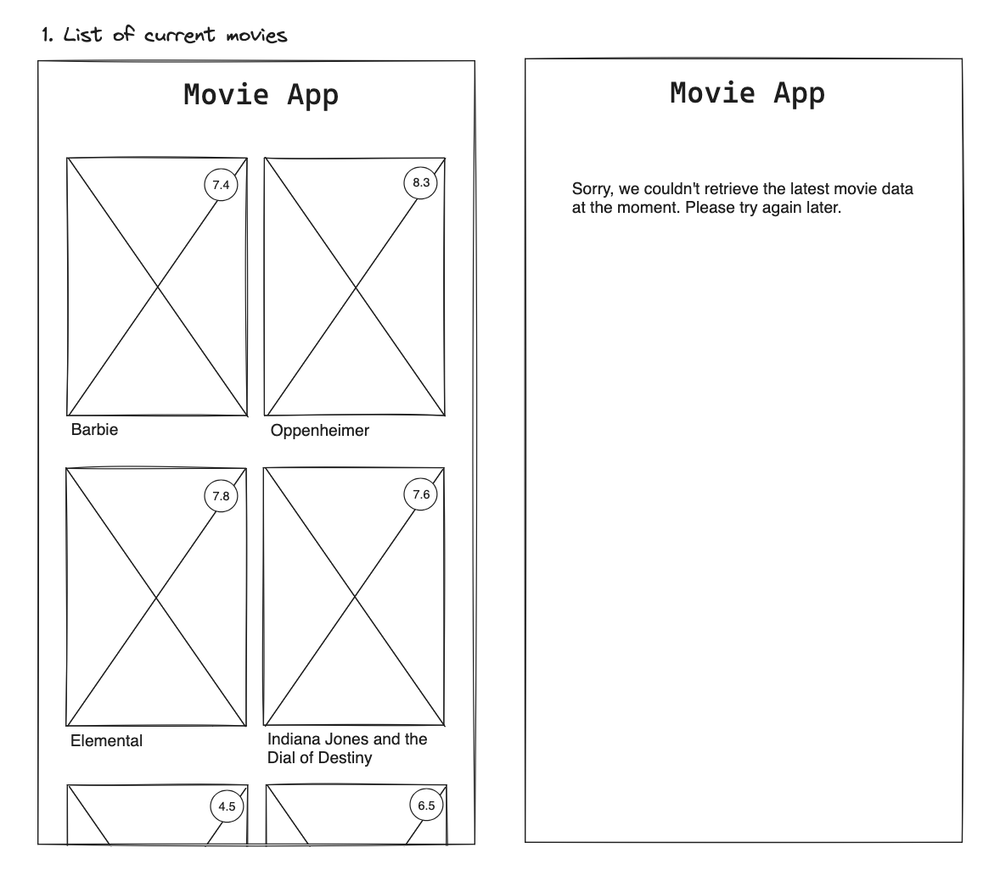

# Title

Homepage, Overview Page Movie App

## Value Proposition

**As a** User  
**I want to** have an overview over the current movies  
**so that** I can scroll through the page and look at the ratings  

## Description

## Acceptance Criteria

- heading: Movie App
- two movie cards displayed next to each other
- title of the movie, picture of the movie, rating in top right corner
- vertical scroll
- when there is no movie displayed: error message

## Tasks

- create a feature branch
- create a database with list of current movies, including title, picture and rating
- build a component with list of current movies
- build a component with movie cards, including title, picture and rating
- vertical scrollbar
- styling
- error message when there is no connection to database
