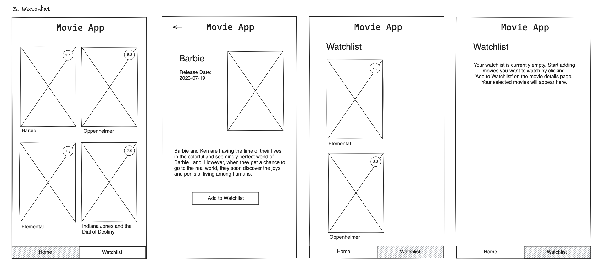

# Title

watchlist page (with chosen movies from the user)

## Value Proposition

**As a** User  
**I want to** add movies to my watchlist  
**so that** I have an overview over the movies I'm interested to watch  

## Description

adding another page to have an overview over the movies the user chose to watch

## Acceptance Criteria

- another page: watchlist
- heading: Watchlist
- navigation bar on bottom of the page
- current page is highlighted in nav bar
- "add to watchlist" button on details page
- message when watchlist is empty
- reloading the page will persit the watchlist

## Tasks

- create a feature branch
- create a new component for the watchlist page, reuse the moviecard component
- create a button on the details page for the user to add a movie to the watchlist page
- create a component for the navigation bar with two tabs called "home" and "watchlist" displayed on the bottom of the overview and watchlist page
- make sure the current page is highlighted in the navbar
- the moviecard on the watchlist are the same as in the overview page but instead of being arranged side by side, they are arranged one below the other
- if there are no movies in the watchlist, display a message to encourage the user to add movies
- save watchlist in local storage
- styling
